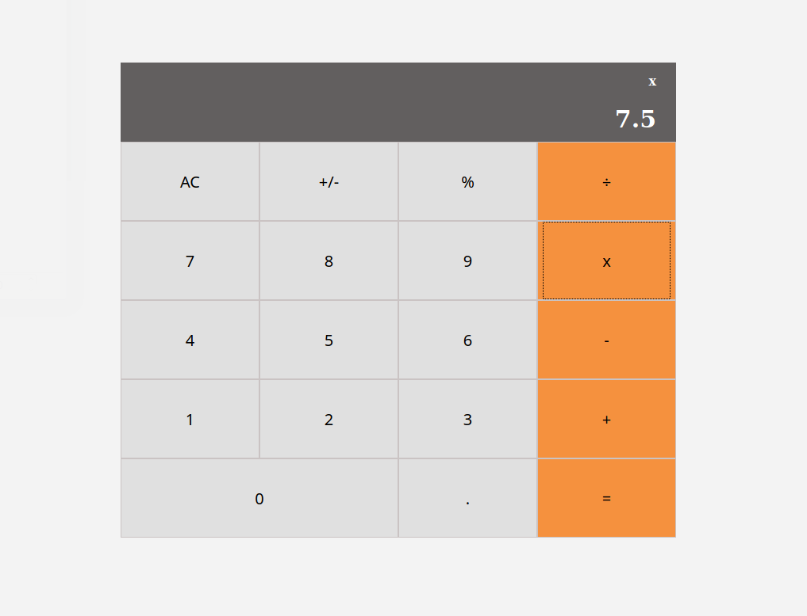

<h1 align="center">
  Math-magicians calculator
</h1>

<h4 align="center"><a href="https://react-calc-bruna.herokuapp.com/">Live version >></a></h4>

## Table of Contents

- [About](https://github.com/bruna-genz/react-calc#built-with)
- [Preview](https://github.com/bruna-genz/react-calc#preview)
- [Built with](https://github.com/bruna-genz/react-calc#built-with)
- [Installation](https://github.com/bruna-genz/react-calc#installation)
- [Author](https://github.com/bruna-genz/react-calc#author)
- [Show your support](https://github.com/bruna-genz/react-calc#show-your-support)

## About

This project consists on a simple calculator app, built with React and deployed with Heroku.

## Preview

## Built With

- HTML5; 
- CSS3;
- JavaScript;
- React;
- Webpack;
- Heroku.

## Installation

To install a local version of this app, download or clone the project [here](https://github.com/bruna-genz/react-calc.git), then enter in the project's directory from the terminal and run the following commands:
- `npm i`
- `npm start`

## Author

:woman: **Bruna Genz**

- Github: [@bruna-genz](https://github.com/bruna-genz)
- Twitter: [@Bruna_GK](https://twitter.com/Bruna_GK)
- Linkedin: [Bruna Genz](https://www.linkedin.com/in/brunagenz/)
- Email: brunagenz92@gmail.com

## Show your support

Give a ⭐️ if you like this project!
